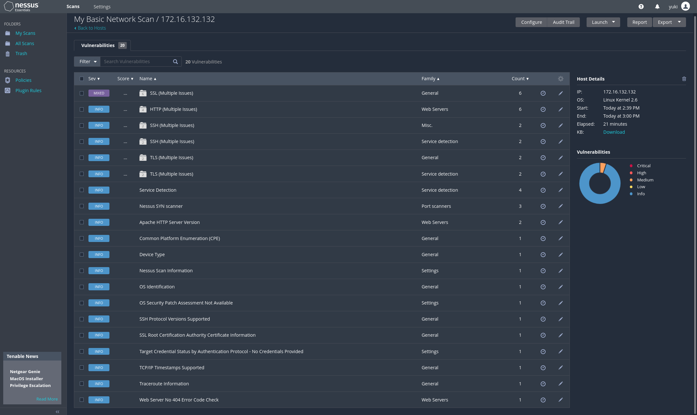
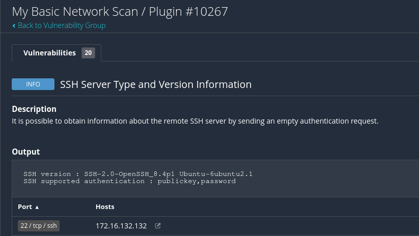
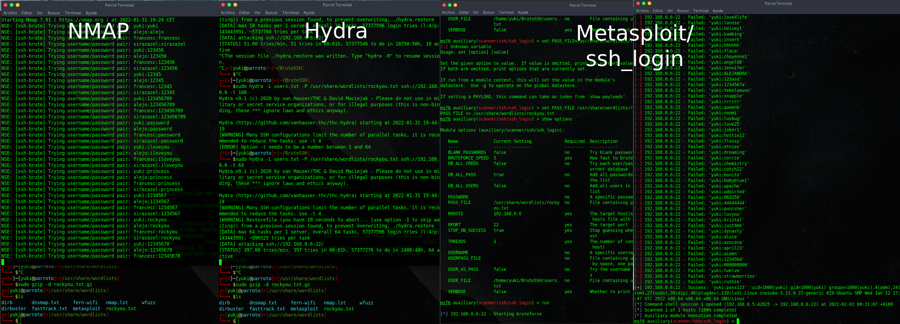
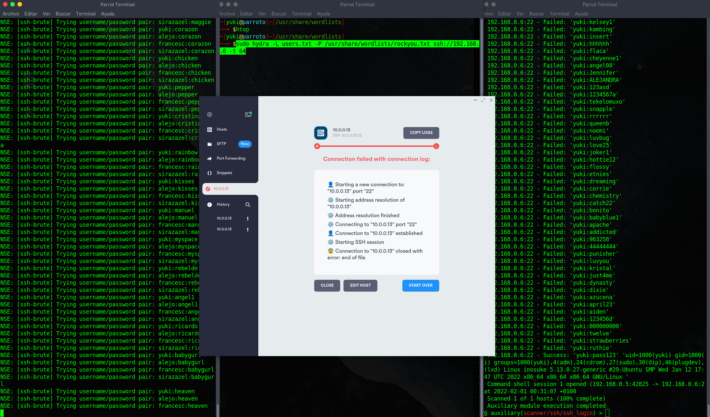
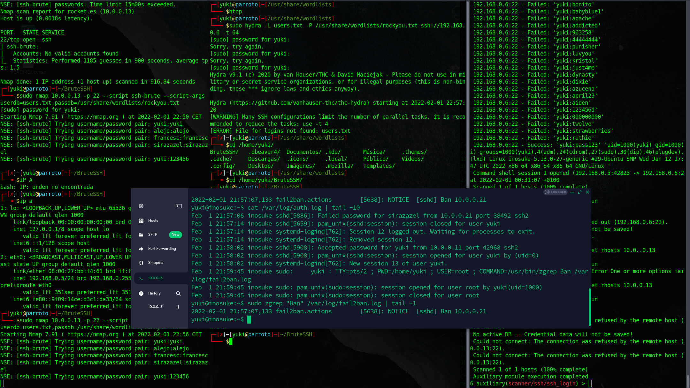
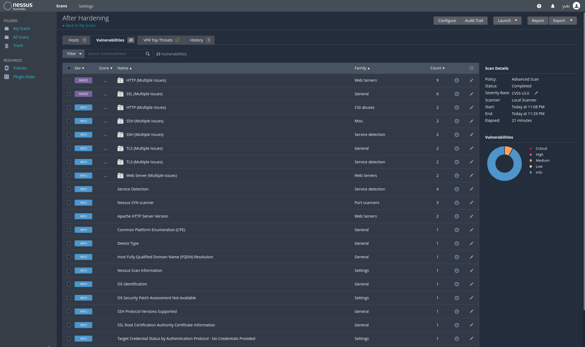

# OpenSSH

### Indice
1. [Introducción](#introducción)
2. [Instalación](#instalación)
3. [Configuración](#conf)
    1. [Por defecto](#sudo)
4. [Pentesting con configuración por defecto](#pen1)
5. [Pentesting con "hardening"](#pen2) 

## Introducción<a name="introducción"></a>

SSH es el acrónimo de secure shell. Este protocolo de administración de shell remota a diferencia de telnet u otros protocolos parecidos y caídos en desuso va encriptado. Al realizar la conexión se establece la comunicación por medio de una clave publica y otra privada. Además de ser útil para la comunicación con servidores también permite crear túneles y transferencia de archivos. En la actualidad es ampliamente utilizado.

## Instalación<a name="instalación"></a>

```bash
$apt install openssh-server
```

## Configuración hardening SSH<a name="conf"></a>

La mayor parte de la configuración de SSH queda plasmada en el archivo `/etc/ssh/sshd_config` la cúal debería tener únicamente permisos de lectura/escritura el usuario root:

+ Asegurarse de utilizar la Versión 2 de SSH ya que la primera tiene vulnerabilidades reconocidas y no es segura. Esto únicamente aplica a versiones OpenSSH Server anteriores a la 7.4
+ Habilitar módulo PAM para tener un mayor control de los accesos de las cuentas de usuario

    ```bash
    ...
    UsePAM yes
    ```

+ Desde el parámetro MaxStartups configuramos el número máximo de conexiones concurrentes

    ```bash
    ...
    MaxStartups 10:30:60

    #OPCIONES RECOMENDADAS EXPLICADAS

    #10 número de conexiones no auténticadas antes de rechazarlas
    #30 % de conexiones rechazadas una vez iniciadas las 10 primeras
    #60 número máximo de conexiones posibles, una vez llegado a este numero el servicio denegará nuevas conexiones
    ```

+ Configurar tiempo de comprobación de actividad o tiempo máximo de inactividad del servidor

    ```bash
    ...
    ClientAliveInterval 300 #Cada cuento se comprueba el estado
    ClientAliveCountMax 0 #Cuanto tiempo de inactividad se permite
    ```

+ Definir número máximo de intentos de inicio de sesión

    ```bash
    ...
    MaxAuthTries 3
    ```

+ Ignorar ficheros de autenticación rhost, muy inseguros

    ```bash
    ...
    IgnoreRhosts yes
    ```

+ Ignorar autenticación por host de confianza

    ```bash
    ...
    HostbasedAuthentication no
    ```

+ Inhabilitar inicio autenticación sin contraseña

    ```bash
    ...
    PermitEmptyPasswords no
    ```

+ Desactivar inicio de sesión de root

    ```bash
    ...
    PermitRootLogin no
    ```

+ Definir algoritmos de Cifrado correctos, asegurar su efectividad

    ```bash
    ...
    Ciphers aes128-ctr,aes192-ctr,aes256-ctr  
    HostKeyAlgorithms ecdsa-sha2-nistp256,ecdsa-sha2-nistp384,ecdsa-sha2-nistp521,ssh-rsa,ssh-dss  
    KexAlgorithms ecdh-sha2-nistp256,ecdh-sha2-nistp384,ecdh-sha2-nistp521,diffie-hellman-group14-sha1,diffie-hellman-group-exchange-sha256  
    MACs hmac-sha2-256,hmac-sha2-512,hmac-sha1
    ```

### Configuración sudo<a name="sudo"></a>

Su archivo de configuración está en `/etc/sudoers`, se puede acceder también con el comando `visudo`:

+ Para evitar que se dejen consolas ejecutando sudo en 2o plano:

    ```bash
    ...
    Defaults use_pty #pty al cerrar la sesión termina el proceso ejecutandose
    Defaults logfile="/var/log/sudo.log" #Definir ruta de logs
    ```

+ Definir que usuarios pueden ejecutar el que con permisos de sudo

    ```bash
    ...
    userX   127.0.0.1=(root:root)   NOPASSWD:apt update
    #user   #host=#contexto de ejecución #param:comando

    #PARÁMETROS
    #NOPASSWD
    #User_Alias
    #Host_Alias
    #Cmnd_Alias

    User_Alias PACO = yuki, paco
    Host_Alias AQUI = 0.0.0.0
    Cmnd_Alias EJE = rm -rf /*

    PACO    AQUI=(root:root)    EJE
    #el user yuki y paco pueden borrar todo el so en el contexto root
    ```

## Pentesting 1 sin Hardening<a name="pen1"></a>

En esta ocasión hemos deployeado una instancia de Nessus para llevar a cabo la fase de reconocimiento, este no nos ha proporcionado más que información básica acerca del sistema en sí y la obviedad de que los certificados al ser autofirmados pueden ser suplantados. Y que debido a que la imagen fue descargada en Agosto tiene instalado el servidor OpenSSH versión 8.4p1, el cual es supuestamente [vulnerable](https://cve.mitre.org/cgi-bin/cvename.cgi?name=CVE-2021-28041). Según he leído tiene relación con un desbordamiento del buffer sin embargo no hay exploit publicado. 

+ [AtackeKB](https://attackerkb.com/topics/Le0EhqXEVb/cve-2021-28041/vuln-details)
+ [VulDB](https://vuldb.com/es/?id.170814)




Otra forma de intentar el ataque, sería con fuerza bruta, aunque no sé si el atacante en este caso podría ni si quiera listar el /etc/passwd para saber que usuarios hay en el sistema. Se los tendría que inventar. Pero suponiendo que se ha descubierto una nueva vulnerabilidad en apache la cual permite path traversal y consigue acceder al archivo. Simulamos el ataque. Primero con nmap y luego con hydra. *Spoiler*: ninguno de los dos funcionará debido a que nmap por defecto limita el tiempo de ataque a 15 minutos, y con hydra y la tremenda lista de rockyou.txt a un ritmo tan lento tardariamos 140 días en recorrerla entera. Por último realizamos el ataque utilizando un script del framework metasploit conocido como `ssh_login` y tras 6 horas finalmente da con el password de una de las cuentas. No es ni de lejos la forma más limpia, pero es un recurso más para comprometer un sistema.

```bash
$gzip -d rockyou.txt.gz

$nmap IP_x -p 22 --script ssh-brute --script-args userdb=users.txt,passdb=/usr/share/wordlists/rockyou.txt
$hydra -L users.txt -P /usr/share/wordlists/rockyou.txt ssh://IP_x -t 64 //Este -t número son los hilos
$msfconsole
>use auxiliary/scanner/ssh/ssh_login
>set "options"
>run
```



## Pentesting 2 con hardening<a name="pen2"></a>

Una vez realizado el hardening procedemos a ejecutar la misma secuencia de reconocimiento, "explotación" de la vulnerabilidad y finalmente "ownear" el sistema. Tras lanzar el ataque e intentar iniciar una conexión desde un 3er sistema resulta que el servicio ssh no permite ninguna conexión debido a que estamos literalmente realizando un ataque de denegación de servicio. Por lo que para proteger realmente el sistema consideraría instalar un daemon conocido como `fail2ban` para bloquear las ip con intentos de conexión fallidos.



### Fail2ban<a name="f"></a>

Procedemos a la instalación y configuración:

```bash
$apt-get install -y fail2ban
$systemctl start fail2ban
$systemctl enable fail2ban

#Editamos el archivo de configuración con el siguiente texto
$nano /etc/fail2ban/jail.local
```

```yaml
[sshd]
enabled = true
port = 22
filter = sshd
logpath = /var/log/auth.log
maxretry = 3
```

Finalmente reiniciamos el servicio:

```bash
$systemctl restart fail2ban
```

**Desbanear una IP** `$fail2ban-client set sshd unbanip IP_ADDRESS`

Ahora nada más comenzar el ataque bloqueará por IP los intentos de autenticación que provocan el DDOS y nos dejará acceder normalmente al terminal remoto. Como se ve en la captura a continuación:



Tras un reescaneo del servidor con Nessus, no detectamos ninguna diferencia entre el anterior escaneo y este.

